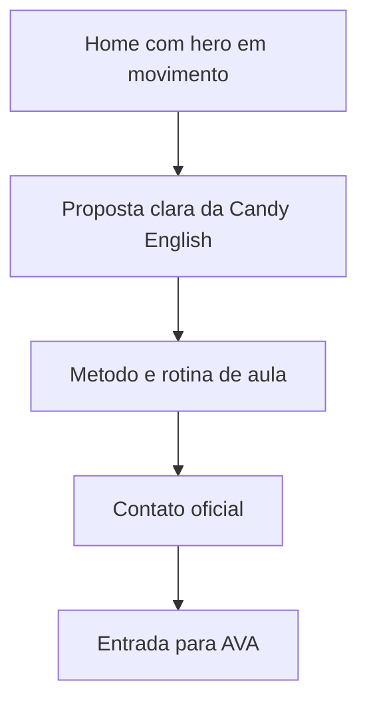
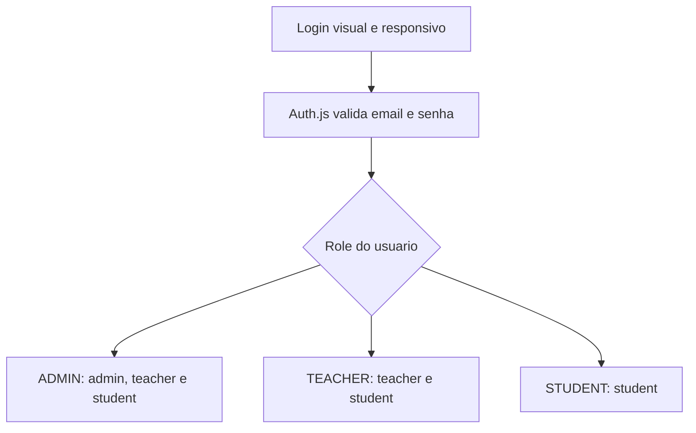

# Direcao Visual - Candy English

> Documento especializado de design. Use junto com `docs/01-arquitetura.md` e `docs/04-padroes-de-codigo.md`.

Este documento registra a direcao visual usada a partir da FASE 7.

## Referencias

- Toggl: referencia de paleta viva, roxo como base e contraste editorial.
- SquadEasy: referencia de movimento, ritmo visual e sensacao de produto ativo.

As referencias servem apenas como inspiracao de qualidade, ritmo e energia. O layout, textos e componentes sao proprios da Candy English.

## Tese Visual

Candy English deve parecer uma escola digital leve, organizada e humana: roxo profundo como base de confianca, rosa/coral como energia, fundos claros para leitura e movimento suave para mostrar progresso.

Na home, a direcao pode ficar mais cinematografica: video em tela cheia, navegacao glass, tipografia editorial e poucos elementos competindo com a marca.

## Paleta

- Roxo principal: `#412a4c`
- Roxo profundo: `#2c1338`
- Rosa energia: `#e57cd8`
- Coral suave: `#fce5d8`
- Fundo claro: `#fefbfa`
- Texto auxiliar: `#6b5a74`

Essas cores ficam centralizadas em `src/app/globals.css` usando tokens do Tailwind/shadcn.

## Assets

- Favicon: `public/favicon.svg`, usando a bala SVG transparente enviada pela Candy.
- Logo principal no header: `public/brand/logo-2.svg`, horizontal, maior e sem caixa de fundo.
- Logo alternativa: `public/brand/logo-1.svg`
- Logo hero: `public/brand/logo-3.svg`
- Catty: `public/brand/catty.png`
- Video do login do AVA: `public/brand/ava-login.mp4`
- Video principal da home: `public/brand/home.mp4`
- Video de paginas informativas: `public/brand/informacoes.mp4`
- Video do AVA student: `public/brand/ava-student.mp4`

Os SVGs sao usados como arquivos estaticos. Nao colocar logos dentro de codigo como string.

## Movimento

Movimentos permitidos nesta fase:

- video fullscreen em loop na home;
- segunda secao da home com video em loop e cards translucidos, sem esconder conteudo;
- paginas informativas com video em loop no fundo e overlay roxo para leitura;
- video fullscreen em loop no login do AVA, mantendo overlay roxo para foco no formulario;
- entrada curta de headline, texto e botoes no hero;
- grid cinetico muito leve no hero;
- cards flutuantes com movimento lento;
- marquee de palavras do metodo;
- reveal curto em hero e blocos principais.
- Catty fixo no canto inferior direito no site institucional, no login do AVA e nos paineis logados do AVA.
- WhatsApp fixo no canto inferior direito acima da Catty no site institucional e no login do AVA.

Cuidados:

- respeitar `prefers-reduced-motion`;
- nao usar movimento em formularios de login/admin que atrapalhe foco;
- nao usar decoracao em bolhas/orbs;
- manter contraste alto em texto sobre fundo roxo.
- usar `prefers-reduced-motion` para reduzir animacoes quando o navegador pedir.
- videos globais, balas e GIFs decorativos foram removidos para manter leitura, performance e foco.
- Catty aparece nos paineis logados do AVA por pedido explicito; revisar posicionamento se cobrir botoes, formularios, contratos ou tarefas.
- WhatsApp tambem nao aparece nos paineis logados do AVA, para nao disputar espaco com a operacao.
- Teacher e student devem abrir uma tarefa por vez com `?task=`, como o admin.
- Resumo do usuario no AVA usa card compacto, com email truncado e botoes dentro da propria caixa.
- Admin deve listar usuarios por role em colunas separadas para reduzir confusao visual.
- Home nao deve usar marca decorativa solta sobre os cards do hero.
- Footer nao deve colocar a logo em card branco; usar marca textual simples quando o fundo for roxo.
- Home pode usar navbar glass apenas na rota `/`; demais paginas mantem leitura clara com header normal.
- O video da home deve ser o elemento visual principal, sem blobs ou decoracoes extras.
- Quando houver usuario logado, o header institucional pode exibir um selo compacto de sessao perto do botao AVA.
- O selo de sessao e informativo; a navegacao deve ficar no botao AVA.
- `Planos` nao aparece na navegacao principal; a rota pode continuar existindo para compatibilidade.
- Secoes de produto, como o bloco do AVA na home, podem usar particulas discretas e hover em cards para dar vida sem poluir a leitura.
- Cards de admin/teacher devem usar contraste roxo suave, sem ficar em branco puro quando a tela precisar de hierarquia.
- A barra lateral do AVA deve parecer uma area de trabalho clara: contraste maior que o fundo, grupos com borda suave e item ativo marcado com roxo solido.
- A area `Aulas e Materiais` do student deve centralizar as aulas em uma superficie ampla; aulas interativas usam status simples de conclusao com bolinha verde/vermelha.

## Fluxo Visual Do Site

## Fluxo Visual Do AVA

## Regras Para Proximas Telas

- Usar componentes shadcn ja existentes antes de criar markup novo.
- Formularios devem usar React Hook Form + Zod.
- Cada tela deve ter uma funcao principal clara.
- AVA deve ser mais operacional e denso; site institucional pode ser mais visual.
- Nao criar landing page vazia: a primeira tela precisa mostrar a experiencia real.
- Documentar qualquer mudanca grande de identidade neste arquivo.
