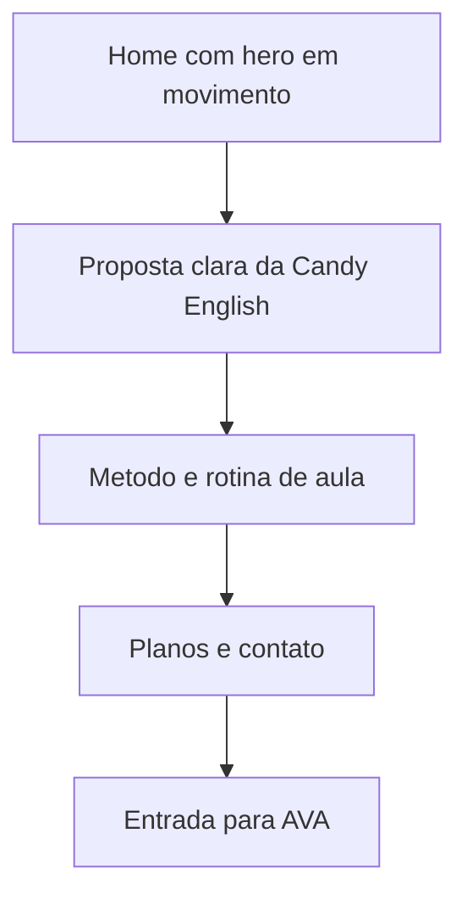
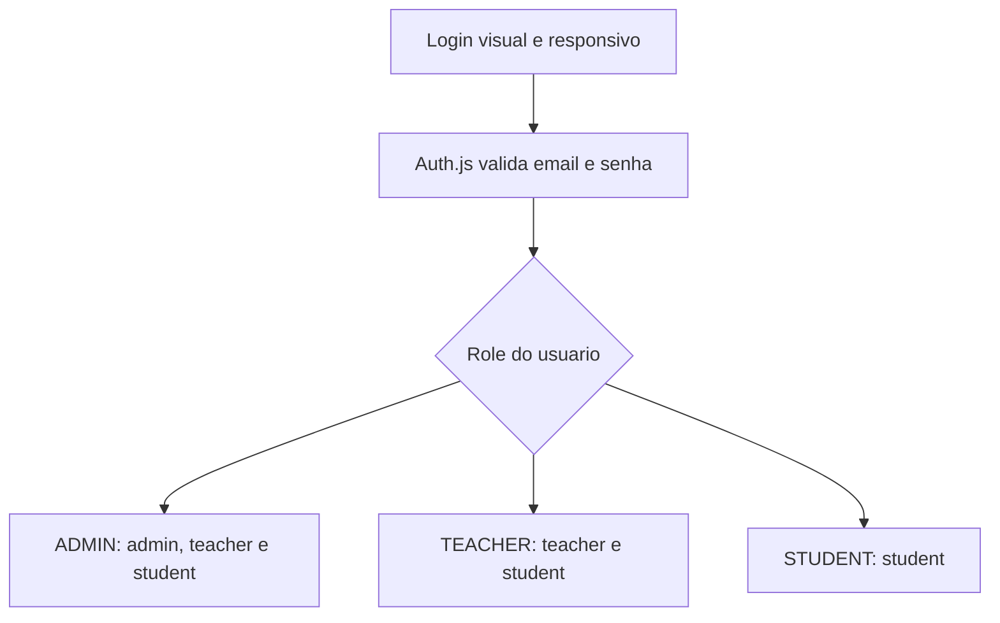

# Direcao Visual - Candy English

Este documento registra a direcao visual usada a partir da FASE 7.

## Referencias

- Toggl: referencia de paleta viva, roxo como base e contraste editorial.
- SquadEasy: referencia de movimento, ritmo visual e sensacao de produto ativo.

As referencias servem apenas como inspiracao de qualidade, ritmo e energia. O layout, textos e componentes sao proprios da Candy English.

## Tese Visual

Candy English deve parecer uma escola digital leve, organizada e humana: roxo profundo como base de confianca, rosa/coral como energia, fundos claros para leitura e movimento suave para mostrar progresso.

## Paleta

- Roxo principal: `#412a4c`
- Roxo profundo: `#2c1338`
- Rosa energia: `#e57cd8`
- Coral suave: `#fce5d8`
- Fundo claro: `#fefbfa`
- Texto auxiliar: `#6b5a74`

Essas cores ficam centralizadas em `src/app/globals.css` usando tokens do Tailwind/shadcn.

## Assets

- Favicon: `public/favicon.svg`
- Logo principal no header: `public/brand/logo-2.svg`, horizontal, maior e sem caixa de fundo.
- Logo alternativa: `public/brand/logo-1.svg`
- Logo hero: `public/brand/logo-3.svg`
- Catty: `public/brand/catty.png`

Os SVGs sao usados como arquivos estaticos. Nao colocar logos dentro de codigo como string.

## Movimento

Movimentos permitidos nesta fase:

- grid cinetico muito leve no hero;
- cards flutuantes com movimento lento;
- marquee de palavras do metodo;
- reveal curto em hero e blocos principais.
- Catty fixo no canto inferior direito no site institucional e no login do AVA.

Cuidados:

- respeitar `prefers-reduced-motion`;
- nao usar movimento em formularios de login/admin que atrapalhe foco;
- nao usar decoracao em bolhas/orbs;
- manter contraste alto em texto sobre fundo roxo.
- usar `prefers-reduced-motion` para reduzir animacoes quando o navegador pedir.
- videos globais, balas e GIFs decorativos foram removidos para manter leitura, performance e foco.
- Catty nao aparece nos paineis logados do AVA para nao cobrir botoes, formularios, contratos ou tarefas.

## Fluxo Visual Do Site

## Fluxo Visual Do AVA

## Regras Para Proximas Telas

- Usar componentes shadcn ja existentes antes de criar markup novo.
- Formularios devem usar React Hook Form + Zod.
- Cada tela deve ter uma funcao principal clara.
- AVA deve ser mais operacional e denso; site institucional pode ser mais visual.
- Nao criar landing page vazia: a primeira tela precisa mostrar a experiencia real.
- Documentar qualquer mudanca grande de identidade neste arquivo.
