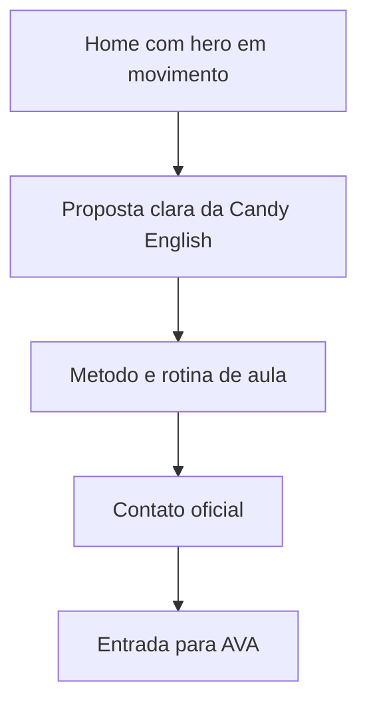
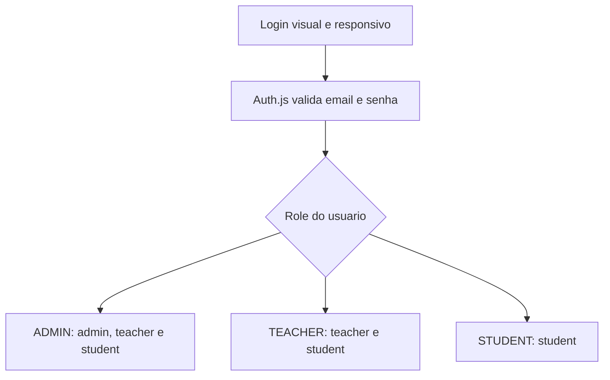

# Direcao Visual - Candy English

> Documento especializado de design. Use junto com `docs/01-arquitetura.md` e `docs/04-padroes-de-codigo.md`.

Este documento registra a direcao visual usada a partir da FASE 7.

## Referencias

- Toggl: referencia de paleta viva, roxo como base e contraste editorial.
- SquadEasy: referencia de movimento, ritmo visual e sensacao de produto ativo.

As referencias servem apenas como inspiracao de qualidade, ritmo e energia. O layout, textos e componentes sao proprios da Candy English.

## Tese Visual

Candy English deve parecer uma escola digital leve, organizada e humana: roxo profundo como base de confianca, rosa/coral como energia, fundos claros para leitura e movimento suave para mostrar progresso.

Na home, a direcao pode ficar mais cinematografica: video em tela cheia, navegacao glass, tipografia editorial e poucos elementos competindo com a marca.

## Paleta

- Roxo principal: `#412a4c`
- Roxo profundo: `#2c1338`
- Rosa energia: `#e57cd8`
- Coral suave: `#fce5d8`
- Fundo claro: `#fefbfa`
- Texto auxiliar: `#6b5a74`

Essas cores ficam centralizadas em `src/app/globals.css` usando tokens do Tailwind/shadcn.

## Assets

- Favicon: `public/favicon.svg`, usando a bala original da Candy centralizada sobre fundo branco circular para evitar caixa branca quadrada na aba do navegador.
- Logo principal no header: `public/brand/logo-2.svg`, horizontal, maior e sem caixa de fundo.
- Logo alternativa: `public/brand/logo-1.svg`
- Logo hero: `public/brand/logo-3.svg`
- Catty: `public/brand/catty.png`
- Video do login do AVA: `public/brand/ava-login.mp4`
- Video principal do contato final da home: `public/brand/home.mp4`
- Video de fundo do hero da home: `public/brand/home-candy.mp4`
- Video principal atual do hero da home: `public/brand/home-candy-2.mp4`
- Videos dos cards de intro da home: `public/brand/intro-1.mp4` e `public/brand/intro-2.mp4`
- Video de paginas informativas: `public/brand/informacoes.mp4`
- Video do AVA student: `public/brand/ava-student.mp4`

Os SVGs sao usados como arquivos estaticos. Nao colocar logos dentro de codigo como string.

## Movimento

Movimentos permitidos nesta fase:

- hero da home com video local leve `public/brand/home-candy-2.mp4` em loop, muted/autoplay, como fundo do primeiro card dominante com fundo branco reduzido, proporcao mais fechada e zoom leve para aproveitar melhor a arte; `public/brand/intro-1.mp4` e `public/brand/intro-2.mp4` ficam embutidos dentro desse mesmo palco, aproveitando o espaco livre, tambem em loop mudo e com botoes visiveis para pausar/retomar e ligar/desligar som;
- video da home reaproveitado no bloco final de contato, com overlay claro e footer invadindo a secao; o efeito gooey do rodape deve sobrepor o video sem faixa, linha divisoria dura ou degradê de transicao;
- segunda secao da home com video em loop e cards translucidos, sem esconder conteudo;
- paginas informativas com video em loop no fundo e overlay roxo para leitura;
- video fullscreen em loop no login do AVA, mantendo overlay roxo para foco no formulario;
- entrada curta de headline, texto e botoes no hero;
- grid cinetico muito leve no hero;
- cards flutuantes com movimento lento;
- marquee de palavras do metodo;
- reveal curto em hero e blocos principais.
- Catty fixo no canto inferior direito no site institucional, no login do AVA e nos paineis logados do AVA.
- Catty fica acima do WhatsApp no site institucional e no login do AVA; WhatsApp fica como botao inferior.

Cuidados:

- respeitar `prefers-reduced-motion`;
- nao usar movimento em formularios de login/admin que atrapalhe foco;
- nao usar decoracao em bolhas/orbs;
- manter contraste alto em texto sobre fundo roxo.
- usar `prefers-reduced-motion` para reduzir animacoes quando o navegador pedir.
- videos globais, balas e GIFs decorativos foram removidos para manter leitura, performance e foco.
- Catty aparece nos paineis logados do AVA por pedido explicito; revisar posicionamento se cobrir botoes, formularios, contratos ou tarefas.
- WhatsApp tambem nao aparece nos paineis logados do AVA, para nao disputar espaco com a operacao.
- Teacher e student devem abrir uma tarefa por vez com `?task=`, como o admin.
- Resumo do usuario no AVA usa card glass compacto com respiro extra no topo dos paineis, email truncado, acoes dentro da propria caixa e microbarra Candy XP animada com metricas curtas quando houver snapshot de progresso da role logada; em mobile/tablet o topo deve empilhar sem cortes, os headers de tarefa devem centralizar icone/titulo e os cards de metricas so devem virar colunas quando houver largura real.
- Perfil interno do AVA usa cards suaves com fundo glass claro, hierarquia por icones, painel de completude student com barra amarela/roxa e recompensa de ate 300 XP, resumo superior de campos/XP, formulario separado por dados principais e dados do aluno, alem de foto em lateral com borda/ring discreto para dar acabamento sem perder leitura operacional.
- Admin deve listar usuarios por role em colunas separadas para reduzir confusao visual; a tela de `Usuarios` usa cores distintas por role (admin amber, teacher pink e aluno sky), metricas com acentos proprios, barra de saude da role, indicadores uteis por usuario e sinais de pendencia em chips claros para nao ficar monocromatica.
- A tarefa admin `Vincular aluno` deve mostrar o relacionamento como mapa teacher -> aluno: formulario com previa do vinculo selecionado, contadores separados do titulo, resumo compacto de teachers/alunos/vinculos e cards agrupados por teacher com linhas de alunos, email e data para deixar claro quem aparece para quem.
- Formularios administrativos de criacao de aluno devem ser agrupados por acesso, perfil e dados do aluno, com superficies claras, icones discretos e acao final evidente para reduzir erro operacional.
- O formulario `Criar admin` deve deixar a permissao administrativa mais evidente: bloco de acesso com contraste proprio, campos de login bem separados, aviso compacto de seguranca e botao final forte, sem alterar a regra server-side de criacao.
- O formulario `Criar teacher` deve destacar a funcao pedagogica: acesso com acento rosa, cards de aulas/alunos/feedback, bio interna em superficie propria e aviso compacto sobre criacao de aulas, correcao e acompanhamento, sem alterar permissoes server-side.
- A tela teacher `Criar/Ver Homework` deve parecer um painel operacional: formulario de criacao em blocos claros com passos aluno/arquivo/editor, upload visivel, fila de criacao com status e lista de atividades em cards escaneaveis com aluno, aula, arquivo, salvamento e quantidade de areas.
- A tela teacher `Criar/Ver Aulas` usa o mesmo motor interativo, mas deve parecer fluxo de aula: resumo superior com aulas/areas/alunos, passos teacher/aluno/aula, formulario de upload com acento azul e cards de aula interativa diferenciados dos cards de homework.
- A tela `Corrigir homework` deve priorizar a leitura por aluno: resumo de pendentes/corrigidos/devolvidos, abas com cor clara, cards recolhidos com aluno em destaque, status, arquivo, aula, teacher e datas bem visiveis antes de abrir o PDF.
- O financeiro admin deve ser intuitivo e escaneavel: separar visao mensal, seletor de mes, formulario de novo aluno, tabela/lista de alunos e log; usar cores semanticas para pago, pendente e vencido, mantendo o conceito de controle interno sem parecer gateway de pagamento.
- A agenda admin deve parecer painel operacional, nao planilha confusa: fila de hoje e proximos 7 dias no topo, resumo mensal com cores semanticas, seletor de meses separado, formulario de agenda recorrente guiado e grade mensal por dia com horario, aluno, status e acoes sempre proximos.
- O cofre admin de `APIs e senhas` deve parecer operacional e seguro: topo explicativo com metricas, separacao visual entre registros `.env` e manuais, formulario guiado, lista escaneavel, acoes por icones claros, valor sensivel oculto por padrao e revelacao manual.
- Home nao deve usar marca decorativa solta sobre os cards do hero.
- Footer nao deve colocar a logo em card branco; usar marca textual simples quando o fundo for roxo.
- Footer pode usar efeito gooey/lava lamp no topo, com bolhas no mesmo roxo do footer para parecer uma superficie unica, preservando textos e links.
- Nas paginas informativas (`/sobre`, `/metodologia`, `/contato`), o footer deve invadir menos e o grid de cards deve reservar respiro inferior suficiente para nao esconder conteudo.
- Home pode usar navbar glass apenas na rota `/`; demais paginas mantem leitura clara com header normal.
- O item ativo da navegacao institucional deve ter contraste forte em roxo solido para deixar claro onde a pessoa esta.
- O hero da home usa `public/brand/home-candy-2.mp4` como fundo em loop leve do primeiro card, com `object-contain`, palco mais alto e zoom minimo para preservar a arte e evitar cortes na marca. `public/brand/intro-1.mp4` e `public/brand/intro-2.mp4` ficam dentro desse mesmo card como videos embutidos no espaco livre, maiores, mais altos no desktop e com `object-contain` para mostrar a pessoa sem cortar o video, nao em coluna externa, com borda roxa suave, autoplay mudo, loop e controles visiveis de pausa/play e som. O video local `public/brand/home.mp4` continua no bloco final de contato como apoio visual leve, com o footer entrando por cima do modulo por animacao gooey, sem degrade de transicao antes do rodape.
- Quando houver usuario logado, o header institucional pode exibir um selo compacto de sessao perto do botao AVA.
- O selo de sessao e informativo; a navegacao deve ficar no botao AVA.
- `Planos` nao aparece na navegacao principal; a rota pode continuar existindo para compatibilidade.
- A home nao usa mais o bloco intermediario do AVA; as entradas para o AVA ficam no header, hero, footer e rotas dedicadas.
- Cards de admin/teacher devem usar contraste roxo suave, sem ficar em branco puro quando a tela precisar de hierarquia.
- A barra lateral do AVA deve parecer uma area de trabalho clara: contraste maior que o fundo, grupos com borda suave e item ativo marcado com roxo solido.
- A barra lateral do AVA deve deixar cada coisa bem visivel: grupos com cabecalho forte, contagem de atalhos, secoes separadas por marcador/linha, itens com fundo claro e ativo com barra lateral colorida para guiar o olhar.
- A barra lateral do AVA deve acompanhar a rolagem da pagina, sem scroll interno proprio, para o card de perfil e os grupos abertos nao ficarem cortados ou sobrepostos.
- No Student, a barra lateral pode ter acabamento mais gamificado e leve: card de perfil com ring/gradiente Candy, chips pequenos de estudo e bloco `Trilha Candy`, mantendo leitura operacional e sem expor telas tecnicas da Catty.
- A area `Aulas e Materiais` do student deve usar aulas recolhidas por padrao, como lista operacional limpa com resumo superior, cards de metrica, chips de teacher/data/material/vocabulario, selo de XP ganho/possivel por aula e acentos de cor por status; ao abrir uma aula, materiais, vocabulario e atividade interativa ficam em blocos separados, e a atividade ganha uma superficie ampla com status simples de conclusao em bolinha verde/vermelha.
- A area `Responder homework` do student deve priorizar acao e feedback: resumo superior com totais, para fazer, entregues e corrigidas, cards com acento de cor por status, chips de arquivo/prazo/areas, selo de XP ganho/possivel por homework e chamada clara para abrir a atividade sem esconder o autosave.
- Os paineis admin, teacher e student podem usar Candy XP como superficie de gamificacao: bordas de 8px, roxo/rosa da marca, barra amarela de progresso com brilho suave, trilha de niveis infinita, fontes de XP bem escaneaveis, streak, badges, ultimos eventos e slot de spotlight sem prometer jogo executavel antes da fase propria.
- Os cards pequenos de fontes do Candy XP devem usar largura minima responsiva, badges de XP sem sobrepor o titulo e labels com menos espacamento de letras para leitura em paineis estreitos.
- No mobile, o Candy XP deve priorizar leitura em uma coluna para fontes, metricas e cards compactos; a trilha de niveis pode ter rolagem horizontal discreta para nao comprimir os sete passos.
- O painel admin de Candy XP deve usar cards com contraste suficiente para criacao e acompanhamento: formulario agrupado, perguntas como cards individuais e lista de atividades com chips claros de status, XP, perguntas e conclusoes.
- A area `Aula ao vivo` deve tratar a chamada como palco central: configuracao e opcoes ficam acima, e o video aparece largo, centralizado e sem coluna lateral estreita.
- Catty deve soar como uma gatinha mascote-professora da Candy: divertida, fofa, energetica, carinhosa e educativa. Ela encoraja estudar ingles em metas pequenas, responde em ingles quando a pessoa escreve em ingles, evita frases genericas de chatbot, usa expressoes como `Miauw`, `Awnn`, `Uwau`, `Pss pss`, `Nya`, `Catty mode on` e `Bora estudar`, e mantem essa voz tanto na IA via Gemini/OpenAI quanto no fallback local.
- A personalidade oficial da Catty fica em `src/lib/catty-personality.ts`; ajustes de tom, bordoes, baloes e mensagens de bloqueio devem preferir esse arquivo antes de mudar prompts soltos.
- Catty deve parecer mais viva sem dominar a tela: botao com avatar maior, cabecalho contextual, estado de digitacao, atalhos de estudo adaptados a homework, aulas, mensagens, teacher ou admin, e baloes visuais locais para usuarios logados no AVA com primeiro nome e saudacao por horario. Fora do AVA logado, a Catty aparece como mascote publica com baloes aleatorios a cada 10 segundos, posicionada acima do WhatsApp quando ele existir, e no clique mostra apenas um aviso pequeno para entrar no AVA ou virar aluno Candy antes de conversa real.
- Os baloes visuais da Catty usam fala compacta com rabicho, brilho Candy e variacao sutil para visitante, logado e aviso de acesso, sempre sem abrir chat real para visitante.
- Admin e Teacher configuram personalizacao da Catty em uma entrada simples `Catty dos alunos`: selecionar aluno, informar gosto, gerar emojis/sons/bordoes e salvar como memoria leve; a tela tecnica de memoria nao deve aparecer como item separado para Student. O painel deve parecer operacional e escaneavel, com topo de metricas, fluxo rapido, filtros destacados, cards por status e cores distintas para alunos, gostos ativos, memorias, sugestoes e revisao.
- A tela Student `Catty aprendendo` deve ser informativa e acolhedora, nao tecnica: explicar memoria leve com Catty visual, pilares de seguranca, exemplos praticos de personalizacao e aviso de revisao humana, sem expor lista interna de memorias.

## Fluxo Visual Do Site

## Fluxo Visual Do AVA

## Regras Para Proximas Telas

- Usar componentes shadcn ja existentes antes de criar markup novo.
- Formularios devem usar React Hook Form + Zod.
- Cada tela deve ter uma funcao principal clara.
- AVA deve ser mais operacional e denso; site institucional pode ser mais visual.
- Nao criar landing page vazia: a primeira tela precisa mostrar a experiencia real.
- Documentar qualquer mudanca grande de identidade neste arquivo.
