# Fluxos do AVA Candy English

Este documento explica, em portugues simples, como funcionam as FASES 4, 5 e 6 do AVA Candy English.

## Papeis

- **ADMIN**: administra usuarios e pode supervisionar o AVA.
- **TEACHER**: cria aulas, materiais, vocabulario, homeworks e corrige respostas.
- **STUDENT**: acessa aulas, estuda materiais/vocabulario, responde homeworks e ve feedback.

## Visao Geral

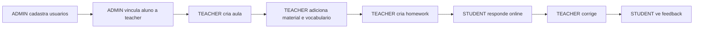

## FASE 4 - Aulas, Materiais e Vocabulario

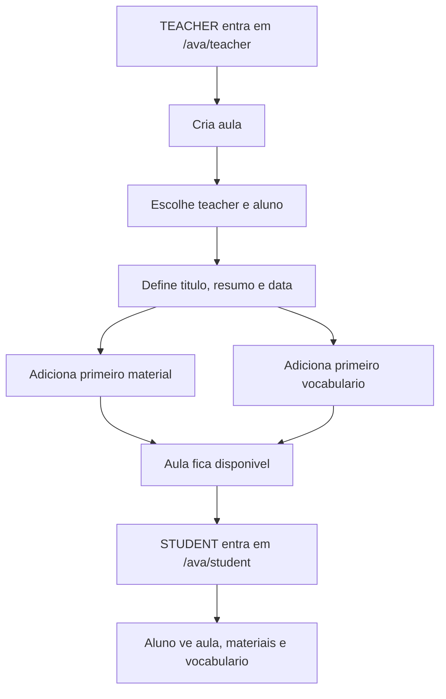

Regras:

- `ADMIN` pode ver a area teacher para supervisao.
- `TEACHER` cria aulas.
- `TEACHER` ve apenas alunos vinculados a sua area.
- `ADMIN` pode criar vinculo aluno-teacher em `/ava/admin`.
- `ADMIN` tambem pode criar o primeiro vinculo aluno-teacher ao criar uma aula.
- Aula vinculada a um aluno aparece para esse aluno.
- PostgreSQL continua interno no Docker.

## FASE 5 - Homework e Resposta

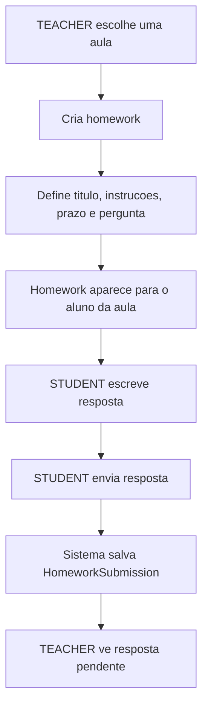

Regras:

- Homework sempre pertence a uma aula.
- Resposta do aluno fica vinculada ao perfil `StudentProfile`.
- O aluno so envia homework vinculada ao proprio perfil.
- Se o aluno reenviar, a resposta anterior e atualizada.
- Depois que a resposta recebe feedback, o reenvio fica bloqueado para preservar a correcao.

## FASE 6 - Correcao e Feedback

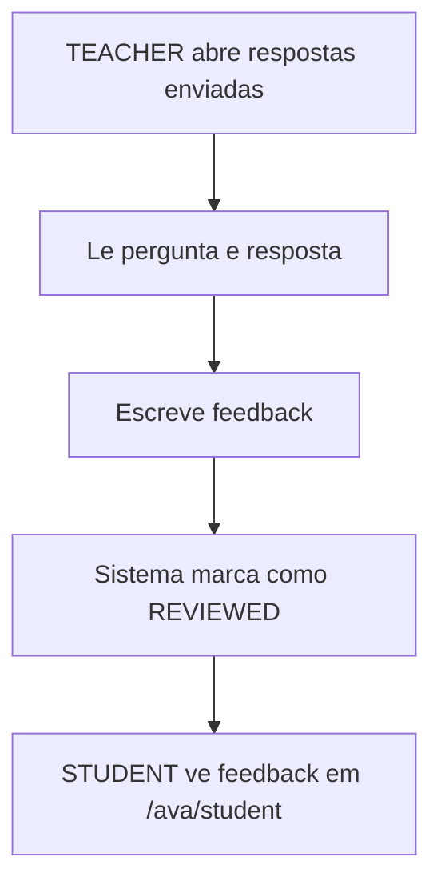

Regras:

- `TEACHER` so corrige respostas de homeworks das proprias aulas.
- `ADMIN` pode supervisionar.
- Feedback fica salvo em `HomeworkSubmission.feedback`.
- Quando corrigida, a resposta muda de `SUBMITTED` para `REVIEWED`.

## FASES 7 a 10 - Visual, Login e Admin

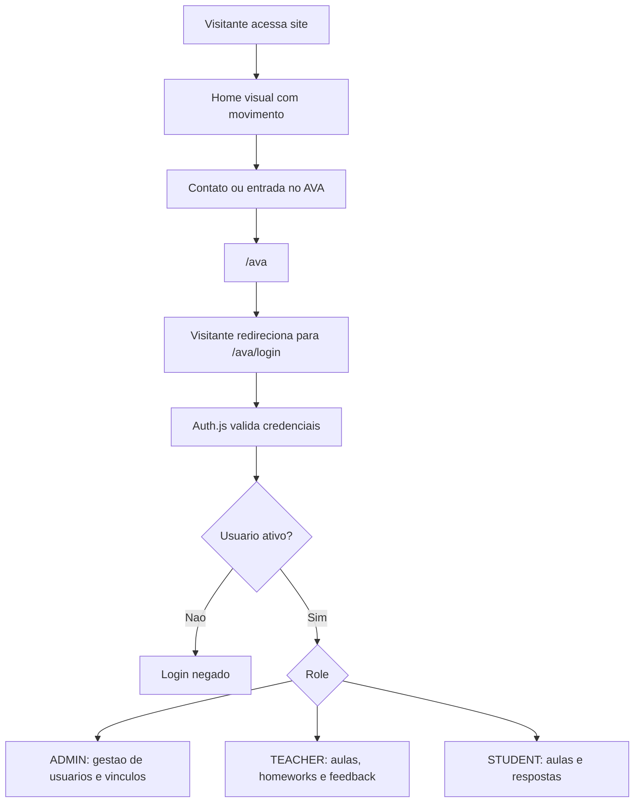

Regras:

- Usuario com `isActive=false` nao entra no AVA.
- `/ava` nao mostra cards intermediarios: visitante vai para `/ava/login`; usuario logado vai para a area do proprio role.
- Muitas falhas recentes de login bloqueiam novas tentativas por seguranca basica.
- Menu do AVA muda conforme role, mas a permissao real continua no servidor.
- Admin nao pode desativar o proprio usuario.
- O sistema deve manter pelo menos um admin ativo.
- Vinculo aluno-teacher orienta quais alunos aparecem para a teacher.

## FASES 11 a 13 - Sidebar, Aula Ao Vivo, Contratos e Catty

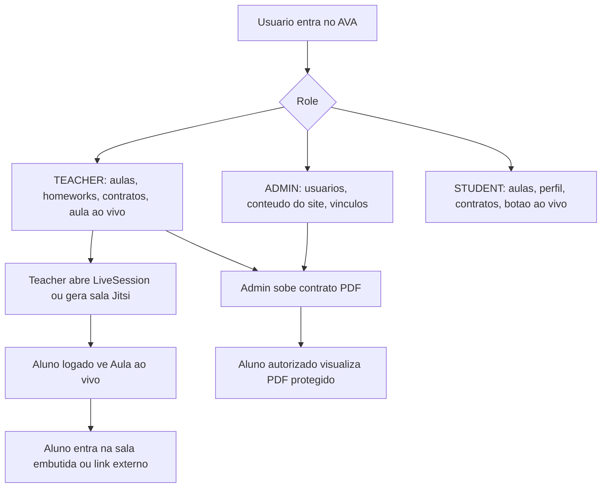

Regras:

- Aula ao vivo gera sala Jitsi Meet embutida quando a teacher deixa o link vazio.
- Link Google Meet ainda pode ser usado, mas abre como sala externa.
- O AVA nao libera o link para visitante sem login.
- Contratos PDF sao servidos por rota protegida.
- Foto do perfil aceita PNG, JPG ou WebP ate 2 MB.
- Contrato aceita PDF ate 8 MB.
- Catty e interface visual; IA real ainda nao esta conectada.
- Catty aparece no site institucional, no login e nos paineis logados do AVA por pedido explicito; WhatsApp continua fora dos paineis logados.
- As animacoes decorativas com video, balas e GIFs foram removidas para reduzir distracao e consumo de recursos.

## Sidebar Operacional

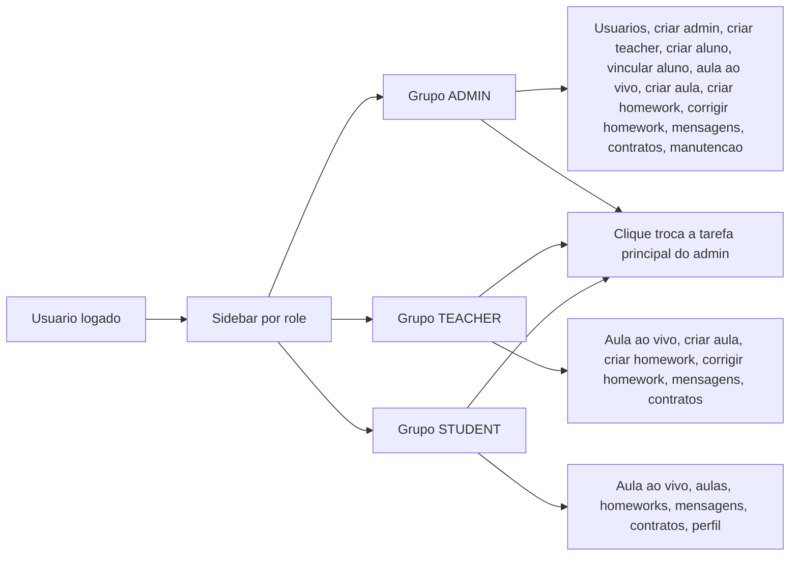

Regras:

- A sidebar deve ser o indice principal de operacao do AVA.
- Grupos como `Admin` e `Teacher` abrem subcategorias ao clicar, para evitar uma lista longa e poluida.
- Para role `STUDENT`, a sidebar fica sempre aberta com botoes roxos porque a area do aluno precisa ser mais direta.
- No admin, os atalhos proprios usam `?task=usuarios`, `?task=criar-admin`, `?task=criar-teacher`, `?task=criar-aluno`, `?task=vincular-aluno`, `?task=contratos` e `?task=editar-site`; atalhos operacionais de aula/homework/mensagens apontam para `/ava/teacher?task=...` porque `ADMIN` pode supervisionar a area teacher.
- Nas areas teacher/student, os atalhos tambem usam `?task=` para mostrar uma tarefa por vez.
- Os campos e tabelas continuam no painel da direita, mas cada bloco precisa ter um atalho claro quando virar tarefa importante.
- Nao usar uma caixa interna com barra de rolagem para atalhos; se houver muitas opcoes, agrupar por role.

## Fluxo Admin Por Tarefa

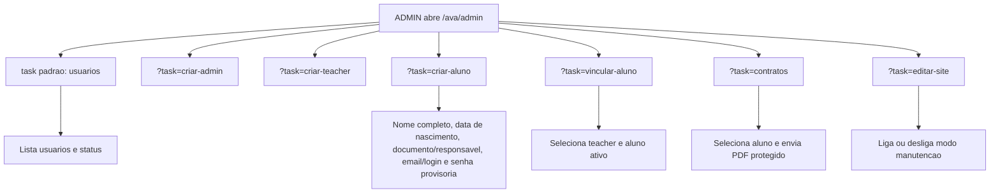

## Fluxo Manutencao Candy

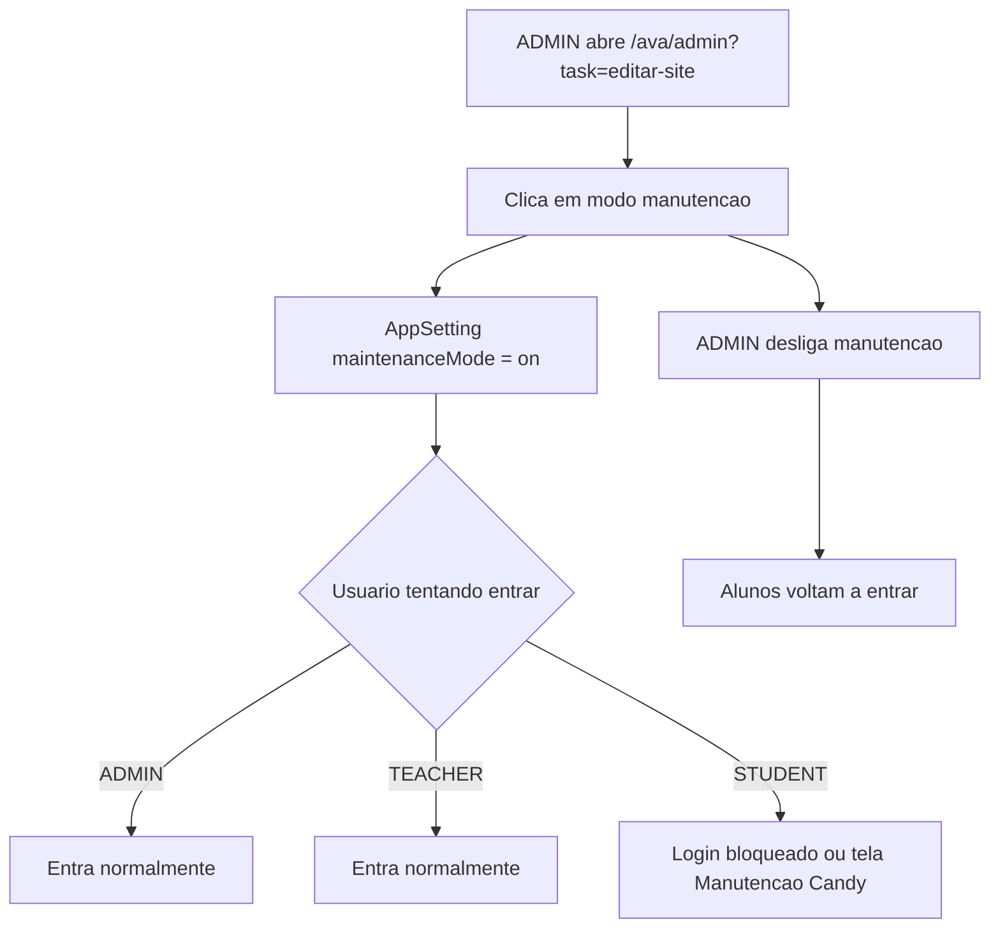

Regras:

- Modo manutencao nao mexe no `.env`.
- Modo manutencao nao apaga dados.
- O bloqueio e aplicado no login e tambem na pagina student para quem ja tinha sessao.

## Fluxo Chatbox Teacher/Aluno

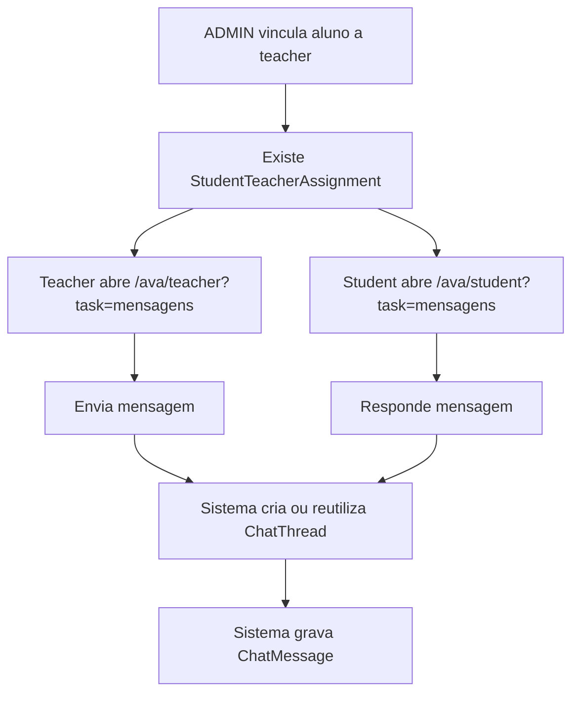

Regras:

- Teacher so conversa com aluno vinculado.
- Student so conversa usando o proprio perfil.
- Admin pode supervisionar a area teacher, mas a conversa continua presa ao vinculo teacher-aluno.

## Fluxo Historico De Usuarios

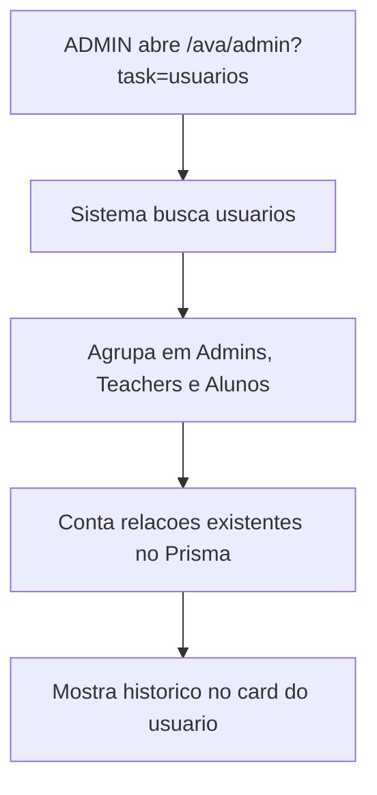

Regras:

- O historico desta fase e calculado com dados ja existentes.
- Nao existe tabela nova de auditoria nesta fase.
- Teacher mostra aulas, homeworks, feedbacks, contratos, chats e aulas ao vivo.
- Aluno mostra vinculos, aulas recebidas, respostas, contratos, chats e aulas ao vivo.

## Fluxo Perfil, Contratos e Materiais

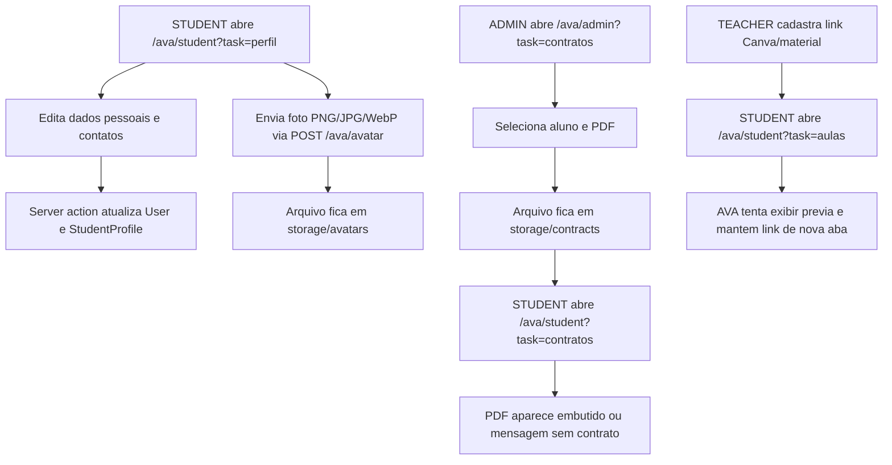

Regras:

- Foto do perfil aceita PNG, JPG ou WebP ate 2 MB.
- A foto atualizada usa rota dedicada `POST /ava/avatar` e deve refletir no card lateral, no resumo superior e no bloco de upload do perfil.
- O aluno edita sexo/contatos/dados pessoais, mas nao edita nivel.
- Teacher/admin atualizam o nivel do aluno na area teacher, com permissao validada por vinculo.
- Contrato aceita PDF ate 8 MB.
- Admin ve uso aproximado de arquivos em MB no painel de usuarios.
- Contratos continuam servidos por rota protegida.
- Material de Canva depende do link permitir visualizacao embutida; se nao permitir, o aluno abre em nova aba.
- Homework online continua sendo o caminho para responder dentro do site; editor Word embutido fica para fase futura.

## Fluxo de Alertas Visuais do AVA

- A sidebar recebe uma assinatura do ultimo evento relevante por modulo.
- O navegador guarda localmente a ultima assinatura vista por link.
- Se a assinatura mudar, o atalho mostra um ponto de alerta.
- Ao clicar ou abrir o modulo, o alerta e marcado como visto e desaparece.

## Fluxo Aula Ao Vivo Embutida

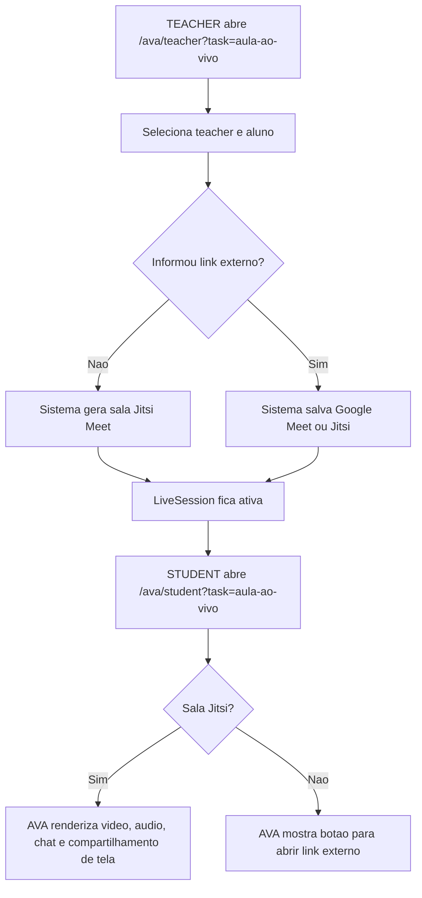

Regras:

- Teacher so abre sala para aluno vinculado.
- Admin pode supervisionar.
- A sala Jitsi usa `meet.jit.si` e e carregada no navegador por iframe API.
- Camera, microfone e compartilhamento de tela dependem de permissao do navegador do usuario.
- Para operacao com escala alta, gravacao ou TURN dedicado, planejar fase propria com LiveKit/Jitsi dedicado.

## Deploy Quando Ha Migration

Use quando `prisma/schema.prisma` ou `prisma/migrations/` mudarem:

```bash
cd /home/ubuntu/candy-english
git pull
docker compose up -d postgres
docker compose build app migrate audit-server-smoke
docker compose --profile tools run --rm migrate
docker compose up -d --force-recreate app
sleep 45
docker compose ps
docker compose --profile tools run --rm audit-server-smoke
```

Termos:

- `git pull`: baixa as alteracoes do GitHub.
- `docker compose build`: cria novas imagens Docker.
- `migrate`: aplica alteracoes no banco.
- `up -d --force-recreate app`: recria o container do site/AVA.
- `ps`: mostra status dos containers.
- `audit-server-smoke`: testa health, home, login e protecao de admin.
- `audit:auth-smoke`: cria usuarios temporarios, testa login real de admin/teacher/student e apaga os testes no final.
- `audit:avatar-smoke`: cria aluno temporario, salva uma foto no storage, faz login e confirma que `/ava/avatar/[userId]` entrega a imagem protegida.

## Cuidados

- Nunca versionar `.env`.
- Nunca expor PostgreSQL publicamente.
- Nao colar `AUTH_SECRET`, `DATABASE_URL` ou senhas em prints publicos.
- Depois de expor segredo em tela, rotacionar o valor no `.env` do servidor.
